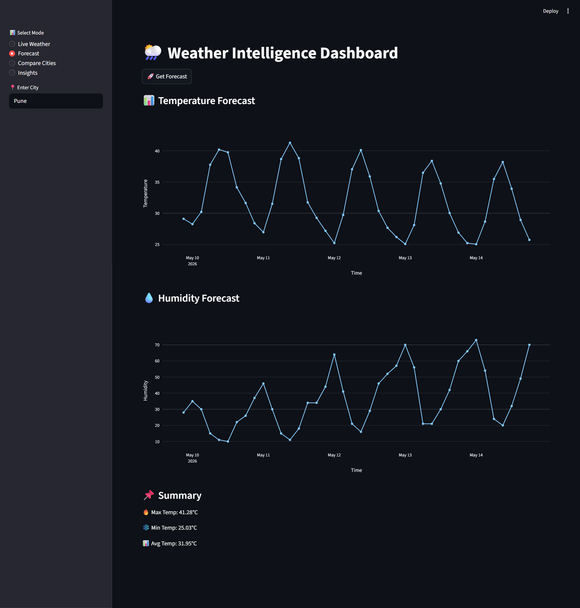

# 🌦️ Weather Forecast & Alert Application

A Python-based Weather Intelligence Dashboard built using Streamlit and OpenWeather API that provides real-time weather updates, forecast analysis, risk scoring, and interactive visualizations.

---

# 🚀 Project Overview

The Weather Forecast & Alert Application is an intelligent system that:
- Fetches real-time weather data using OpenWeather API
- Analyzes temperature, humidity, and weather conditions
- Generates risk-based weather alerts
- Displays interactive dashboards and graphs
- Provides forecast trends for future weather prediction

---

# 🎯 Problem Statement

Most basic weather apps only show temperature.

This project improves it by:
- Adding weather risk analysis
- Providing visual insights using graphs
- Comparing multiple cities
- Generating smart alerts for extreme conditions

---

# 💡 Features

- Live Weather Data Fetching
- 5-Day Forecast Analysis
- Weather Risk Score Engine
- Smart Alerts (Heat, Humidity, Storm)
- Interactive Graphs (Line, Bar, Gauge)
- City Comparison Dashboard
- Clean Streamlit UI
- API Integration using OpenWeatherMap

---

# 🛠️ Tech Stack

- Python
- Streamlit
- OpenWeatherMap API
- Pandas
- Plotly
- Requests
- python-dotenv

---

# 📁 Project Structure

Weather-Forecast-Alert-Application/

- app.py → Main Streamlit application
- requirements.txt → Python dependencies
- .env.example → API key template
- .gitignore → Ignored files (security)
- data/ → Raw or processed data (optional)
- outputs/ → Generated reports
- images/ → Screenshots for GitHub
- reports/ → CSV weather reports
- docs/ → Documentation

---

# 🔑 API Setup

1. Get API Key from:
https://openweathermap.org/api

2. Create `.env` file:

API_KEY=your_api_key_here

3. `.env.example` is included for reference.

---

# ▶️ How to Run Project

# Install dependencies
pip install -r requirements.txt

# Run Streamlit app
streamlit run app.py

---

# 📊 Dashboard Features

# 🌤️ Live Weather
- Temperature
- Humidity
- Weather condition

# 📈 Forecast Analysis
- 5-day trend
- Temperature graph
- Humidity graph

# ⚠️ Risk Engine
- Heat risk detection
- Humidity risk detection
- Storm/rain alerts

# 🏙️ City Comparison
- Compare multiple cities
- Temperature vs humidity charts
- Risk scoring per city

---

# 📸 Sample Outputs

Add screenshots in /images folder:

### Live Weather UI

### Forecast Graph

### Risk Gauge Chart

---

# 🧠 Key Learning Outcomes

- API integration using Python
- Real-time data processing
- Data visualization with Plotly
- Streamlit dashboard development
- Risk scoring algorithm design
- Secure API handling using dotenv

---

# 🔐 Security Note

- Never upload `.env` file to GitHub
- Only `.env.example` is shared
- API keys must remain private

---

# 🚀 Future Improvements

- AI-based weather predictions
- Email/SMS alerts
- Live map visualization
- Historical weather analysis
- Mobile responsive UI

---

# 👨‍💻 Author

Nidhi Apotikar

Student Project – Weather Intelligence System  
Built for learning API integration, dashboards, and data analytics.

---

# ⭐ If you like this project

Star the repository ⭐ and contribute improvements!
